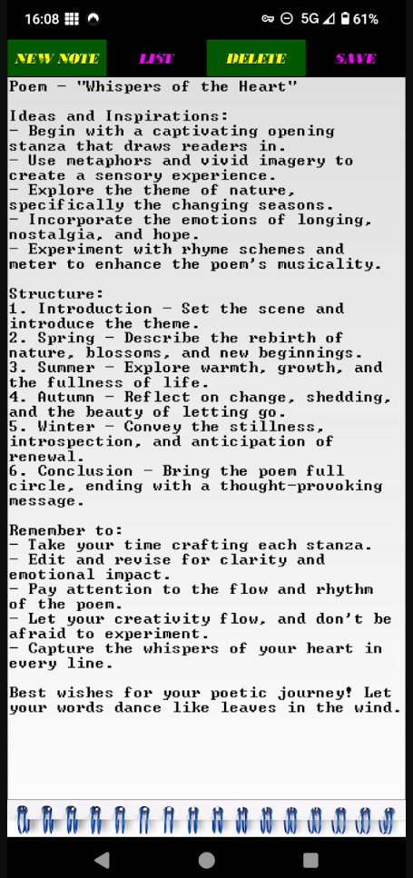
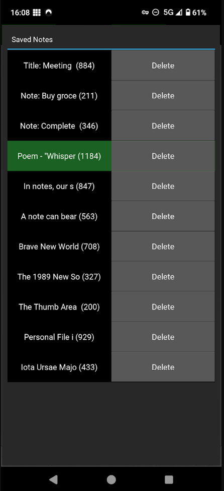

# PureNote
A retro/CRT note-taking app for Android, built with Python and Kivy. 100% local and private — no cloud, no account. Your notes live in a local SQLite database.

# Features
- Multi-note with titles, tags and creation/modification dates
- Live search across titles and bodies
- Tag filtering
- Markdown editor with live preview (headings, bold, italic, code, bullets)
- Interactive checklists: tap `- [ ]` items in the preview to tick them
- Trash with undo: deleted notes are recoverable, with an undo action and a trash bin (restore / empty)
- Pin important notes to the top
- Word / character counter
- Export a note as Markdown and full database backup
- Retro phosphor-green CRT theme

# Run (desktop)
```
python3 -m venv .venv
.venv/bin/pip install "kivy[base]"
.venv/bin/python main.py
```

# Build (Android)
```
pip install buildozer
buildozer -v android debug        # APK
buildozer -v android release      # AAB
```


# Screenshot
, 


# Used
Python
Kivy
Buildozer

# Installation
To install the app on your Android device, download the APK file and follow the installation prompts.
[](https://play.google.com/store/apps/details?id=bbnss.test.purenote&pcampaignid=web_share)

https://play.google.com/store/apps/details?id=bbnss.test.purenote&pcampaignid=web_share

OR

## APK Android
https://github.com/bbnss/PureNote/releases/tag/APK
