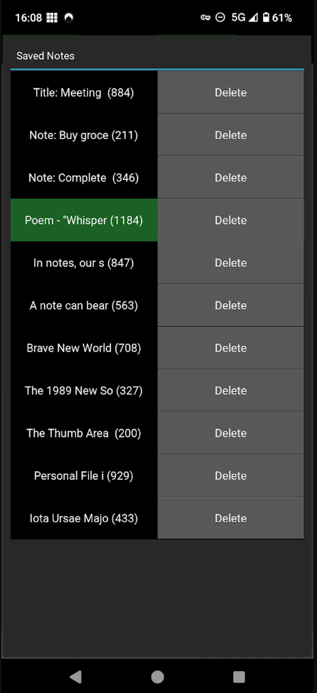

# PureNote
Basic note-taking application for Android, built with Python and Kivy. Store your notes locally for quick access and privacy.

# Features
Create and Edit Notes
Save Notes Locally
Counter letters in the notes
Easy Navigation

# Screenshot
, 

# Used
Python
Kivy
Buildozer

# Installation
To install the app on your Android device, download the APK file and follow the installation prompts.

https://play.google.com/store/apps/details?id=bbnss.test.purenote&pcampaignid=web_share
